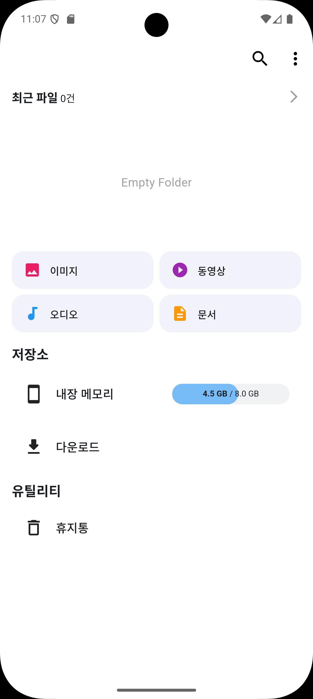
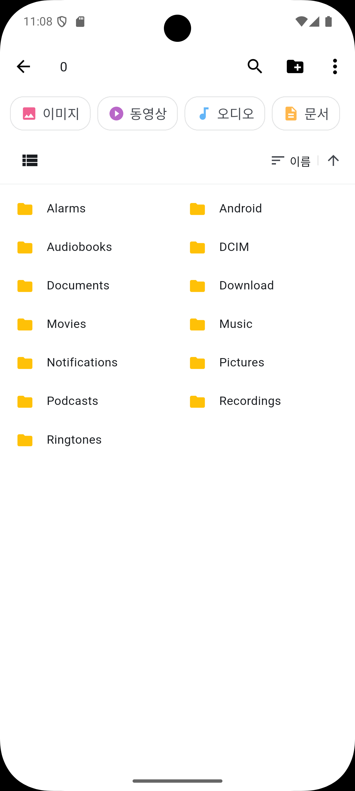
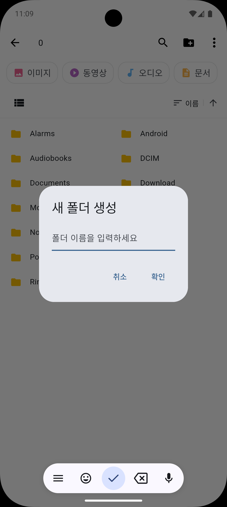
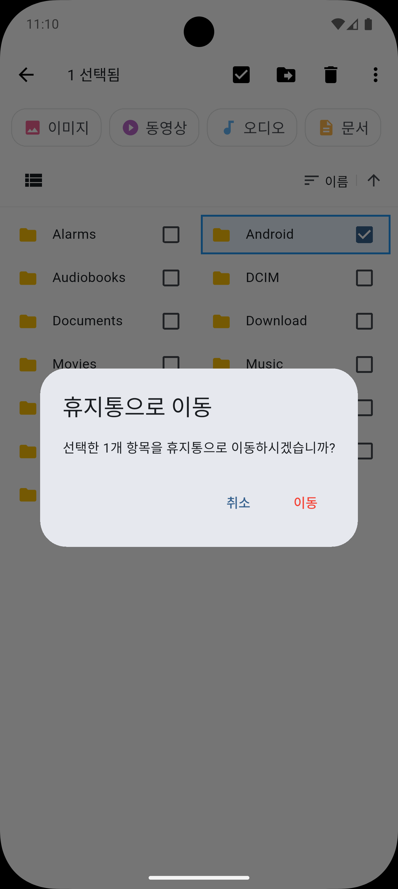
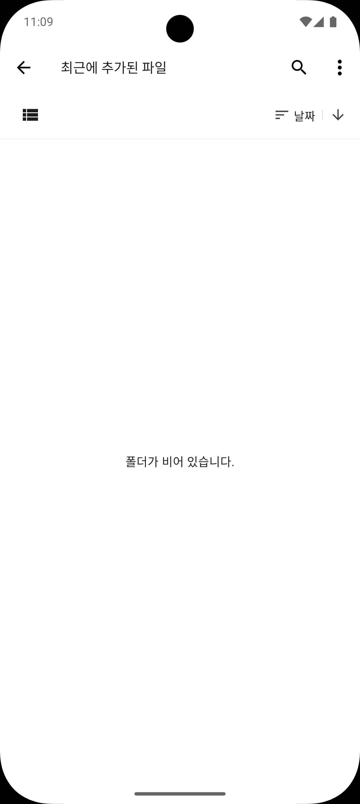
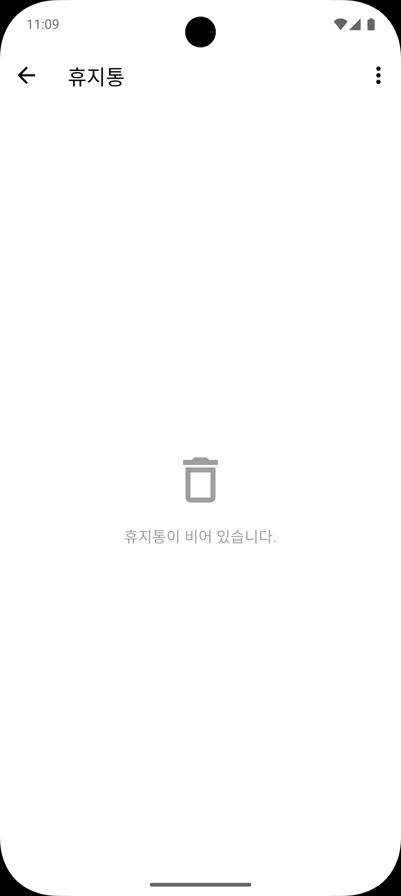

# App FileBrowser (파일 브라우저 프로젝트)

Antigravity를 활용해 제작됐습니다.

Flutter로 구축된 파일 브라우저 애플리케이션입니다.  
드래그 앤 드롭, 다양한 뷰 모드, 폰트 기능 등 사용자 친화적인 인터페이스를 제공하도록 설계되었습니다.

## 주요 기능

- **다양한 뷰 모드**: 리스트, 그리드, 스퀘어 모드를 지원하며 전환 효과를 제공합니다.
- **드래그 앤 드롭**: 항목을 길게 눌러 드래그할 수 있으며, 화면 끝에 도달 시 자동으로 스크롤됩니다.
- **다양한 선택 모드**: 일반 선택, 이동, 삭제 모드 등 상황에 맞는 작업 환경을 제공합니다.
- **Material Design 터치 피드백**: Ink 위젯 패턴을 적용하여 테마나 배경색에 관계없이 리플 효과를 구현했습니다.
- **접근성 중심의 폰트 스케일링**: 사용자 설정에 따라 UI 전체의 크기가 조절되는 폰트 스케일링 시스템을 내장하고 있습니다.
- **검색 및 정렬**: 실시간 필터링이 가능한 검색 기능과 이름, 날짜, 유형, 크기별 정렬 기능을 제공합니다.
- **파일 작업**: 폴더 생성, 파일 이동, 삭제 및 열기(`open_filex` 활용) 기능을 지원합니다.
- **다크 모드 지원**: 시스템 설정에 맞춘 라이트/다크 테마를 지원합니다.

## 스크린샷 (Screenshots)

이 프로젝트의 주요 화면과 사용자 인터페이스를 소개합니다. 모든 UI는 Material 3 디자인 가이드를 준수하며, 직관적인 사용성을 제공합니다.

### 메인 대시보드 (Dashboard)
<p align="center">
  
  <br>
  <i>내장 메모리 사용량, 파일 카테고리(이미지/동영상/오디오/문서), 최근 파일 섹션을 확인할 수 있는 메인 화면입니다.</i>
</p>

---

### 폴더 탐색 (Folder Navigation)
<p align="center">
  
  <br>
  <i>폴더 탐색과 다양한 뷰 모드를 지원합니다.</i>
</p>

---

### 주요 작업 및 인터랙션 (Core Interactions)
파일 관리의 핵심인 생성, 삭제 작업을 다이얼로그로 처리합니다.

| 새 폴더 생성 | 삭제 확인 (휴지통) |
| :---: | :---: |
|  |  |
| **Material Design** 기반의 입력 다이얼로그 | 실수 방지를 위한 **확인 시스템** 및 선택 모드 |

---

### 유틸리티 및 특수 폴더 (Utilities)
효율적인 파일 관리를 위한 보조 도구들을 제공합니다.

| 최근 항목 | 휴지통 |
| :---: | :---: |
|  |  |
| 최근에 추가된 파일을 확인 | 삭제된 파일을 보관 및 복구 |

## 기술 스택

- **Framework**: Flutter
- **State Management**: Provider
- **Local Storage**: Shared Preferences
- **Key Packages**:
  - `path_provider`: 로컬 경로 접근
  - `permission_handler`: 권한 관리
  - `intl`: 다국어 및 날짜 포맷
  - `open_filex`: 파일 실행

## 설치 및 시작하기

1. **저장소 클론**:
   ```bash
   git clone https://github.com/hooha1207/app_fileBrowser.git
   ```

2. **프로젝트 초기화**:
   Windows 환경에서는 제공된 배치 파일을 사용하여 환경을 쉽게 구성할 수 있습니다.
   ```bash
   ./init_flutter_project.bat
   ```

3. **의존성 설치**:
   ```bash
   flutter pub get
   ```

4. **앱 실행**:
   ```bash
   flutter run
   ```

## 아키텍처 및 디자인 가이드

이 프로젝트는 유지보수성과 확장성을 위해 핵심 디자인 패턴을 따릅니다:

- **Ink Widget Pattern**: 모든 터치 가능한 요소는 `Material` + `Ink` + `InkWell` 조합을 사용하여 시각적 피드백을 보장합니다.
- **Font Scaling Extension**: `double`에 대한 extension을 통해 글자 크기, 아이콘 크기, 간격을 비례적으로 조절합니다.
- **Clean Widget Extraction**: 복잡한 UI 비즈니스 로직은 별도의 위젯(예: `FileItemTile`)으로 분리하여 관리합니다.

## 라이선스

이 프로젝트는 **MIT 라이선스**에 따라 배포됩니다. 자세한 내용은 `LICENSE` 파일을 참조하십시오.

## 연락처

문의 사항이나 피드백이 있으시면 아래 이메일로 연락해 주시기 바랍니다:
- **Email**: [hooha1207@gmail.com](mailto:hooha1207@gmail.com)
